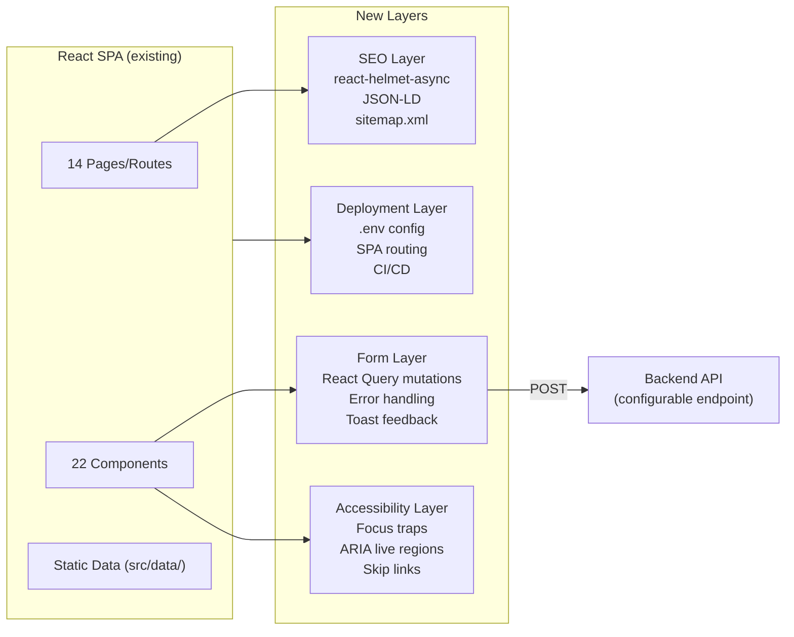
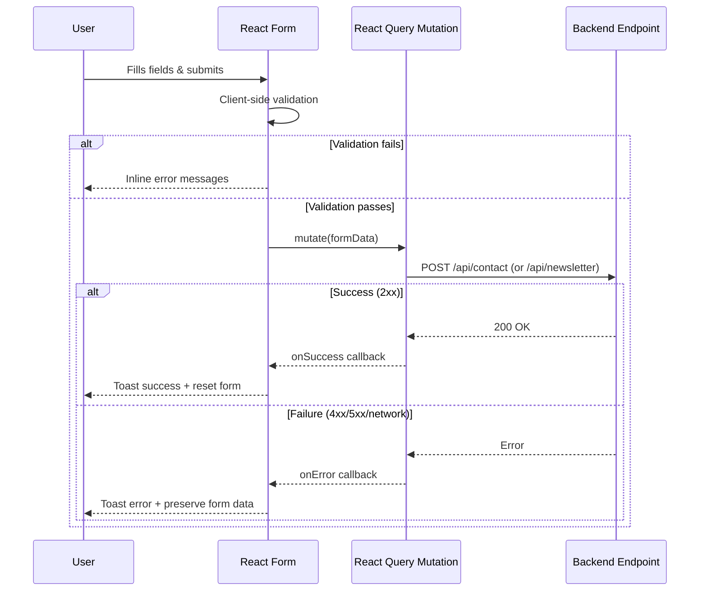
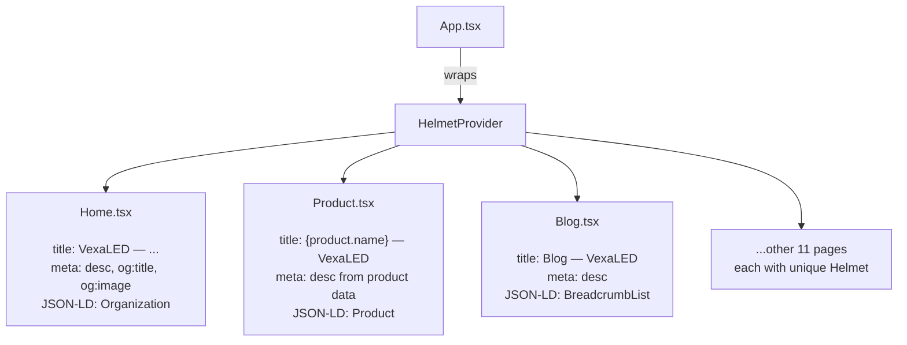
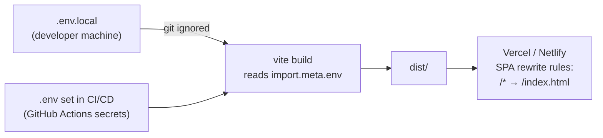

# Design — Website Launch Readiness

> Derived from `requirements.md`

---

## Architecture Overview

The site is a React + Vite SPA using TypeScript, Tailwind CSS, and Framer Motion. All data currently lives in static files under `src/data/` and `src/i18n/`. The completion work adds four layers on top of the existing frontend:

1. **Form Submission Layer** — React Query mutations that POST form data to configurable API endpoints
2. **SEO Layer** — `react-helmet-async` provider at the app root, with per-page `<Helmet>` blocks
3. **Accessibility Layer** — Focus traps, ARIA attributes, skip links, label associations
4. **Deployment Layer** — Environment config, SPA routing config, CI/CD pipeline



---

## Form Submission Design

Each form gets a dedicated React Query mutation. All mutations read their endpoint from `import.meta.env`.



### API Contracts

**Contact / Product Inquiry**
```
POST ${VITE_CONTACT_FORM_ENDPOINT}/contact
Content-Type: application/json

Request:
{
  "name": "string",
  "email": "string",
  "company": "string | null",
  "product": "string | null",
  "message": "string"
}

Response 200: { "success": true }
Response 4xx: { "error": "string" }
```

**Newsletter Signup**
```
POST ${VITE_CONTACT_FORM_ENDPOINT}/newsletter
Content-Type: application/json

Request:
{
  "email": "string"
}

Response 200: { "success": true, "message": "Subscribed" }
Response 4xx: { "error": "string" }
```

---

## SEO Architecture



Each page component includes a `<Helmet>` block at the top of its JSX with:
- Unique `<title>` derived from page/product/case-study data
- Unique `<meta name="description">` (max 160 chars)
- `og:title`, `og:description`, `og:image`, `og:url`
- `twitter:card`, `twitter:title`, `twitter:description`
- JSON-LD script tag where applicable

Static fallback tags remain in `index.html` for crawlers that don't execute JS.

---

## Accessibility Design

| Issue | Solution | Location |
|-------|----------|----------|
| No skip link | Add `<a href="#main" class="sr-only focus:not-sr-only">` as first child of `<body>` | `App.tsx` or layout wrapper |
| No focus trap in modals | Use `focus-trap-react` or manual `keydown` listener | `InquiryModal.tsx`, `SearchOverlay` |
| Missing label associations | Add `id` to inputs, `htmlFor` to labels; or wrap input in label | `Product.tsx:700-752` |
| No ARIA live regions | Add `aria-live="polite"` wrapper around toast container | Toast/Sonner config |
| `alt-hidden` typo | Change to `aria-hidden="true"` | `Product.tsx:85` |
| `alert()` for validation | Replace with `toast.error()` from Sonner | `Configurator.tsx:269` |

---

## Deployment Design



### Environment Variables

| Variable | Purpose | Example |
|----------|---------|---------|
| `VITE_API_URL` | Base URL for API | `https://api.vexaled.com` |
| `VITE_CONTACT_FORM_ENDPOINT` | Form submission endpoint | `https://api.vexaled.com/forms` |
| `VITE_ANALYTICS_ID` | Google Analytics / Plausible ID | `G-XXXXXXXXXX` |
| `VITE_SITE_URL` | Canonical site URL for OG tags | `https://vexaled.com` |

### SPA Routing Config (Vercel)
```json
{
  "rewrites": [{ "source": "/(.*)", "destination": "/index.html" }]
}
```

---

## Key Design Decisions

1. **react-helmet-async over custom `document.title` calls** — Standard library, SSR-ready if needed later, handles all meta/OG/JSON-LD in one place.
2. **React Query mutations over raw fetch** — Already installed, provides retry logic, loading/error states, and cache invalidation for free.
3. **Configurable endpoints over hardcoded backend** — Keeps the frontend backend-agnostic; can point to Formspree for MVP and migrate to custom API later.
4. **focus-trap-react over manual implementation** — Battle-tested, handles edge cases (Shadow DOM, dynamically added elements).
5. **Vercel-first deployment** — Zero-config for Vite projects, free tier available, built-in SPA routing support. Netlify config provided as fallback.
